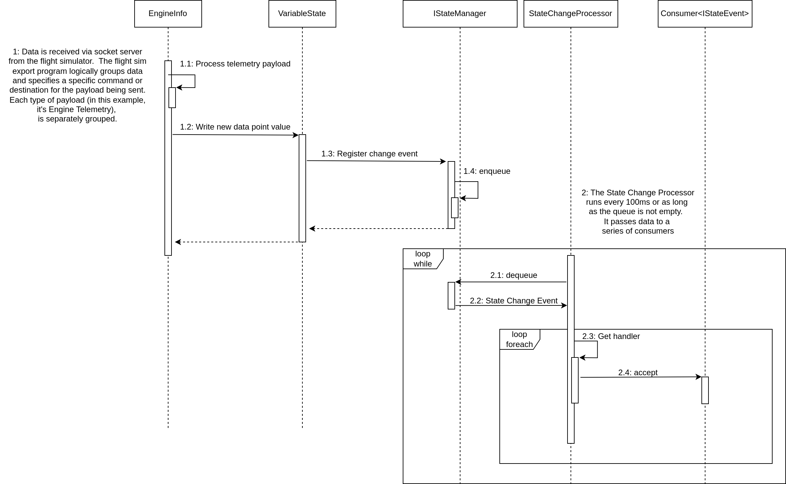

# SimGateway: A Real-Time IoT Platform for Flight Simulators

SimGateway is a complete, end-to-end IoT platform designed to bridge real-time telemetry data from flight simulators like DCS World to custom-built physical hardware. The project was born from a desire to create a more immersive simulation experience by having in-game events drive physical gauges, lights, and displays on a custom-built cockpit panel.

This project is a practical demonstration of architecting a real-time, event-driven, and fault-tolerant system that manages the entire data lifecycle—from in-game data extraction to low-level hardware communication.

## Quick Start Guide

This guide provides a simple, end-to-end example of sending a radio frequency from DCS World to a physical LCD screen connected via an Arduino.

### 1. Hardware Setup (Arduino)

First, upload this C++ sketch to your Arduino. This code initializes an LCD screen and listens on the serial port for messages from the SimGateway server.

```cpp
#include<HID.h>
#include<LiquidCrystal.h>

//..LCD Pin configuration 
const uint8_t RS = 12;
const uint8_t EN = 11;
const uint8_t D4 = 5;
const uint8_t D5 = 4;
const uint8_t D6 = 3;
const uint8_t D7 = 2;

//..The Main LCD Screen
LiquidCrystal lcd( RS, EN, D4, D5, D6, D7 );

//..Serial activity led pin
const uint8_t LED_SERIAL_ACTIVITY = 10;

//..Serial communication constants 
const uint8_t MESSAGE_START = 0x1;  //..A new message is started - the next byte is the hardware address
const uint8_t TEXT_START = 0x2; //..After 1 byte of hardware, this is expected.  Following this is up to VALUE_BYTES of data then TEXT_END followed by MESSAGE_END 
const uint8_t TEXT_END = 0x3;  //..end of payload 
const uint8_t SEPARATOR = 0x1F; //..Unused 
const uint8_t MESSAGE_END = 0x4; //..End of message

//Message buffers 
const uint8_t HEADER_BYTES = 0x3; //..Total bytes in the message header 
const uint8_t VALUE_BYTES = 0x10; //..Max bytes in the text section of the message
const uint8_t FOOTER_BYTES = 0x2; //..Size of footer section in message [TEXT_END,MESSAGE_END]
const uint8_t MAX_BYTES = HEADER_BYTES + VALUE_BYTES + FOOTER_BYTES;

uint8_t header[HEADER_BYTES]; //..The header contents
uint8_t value[VALUE_BYTES];   //..The text section contents 

//..The message processing loop states
const uint8_t STATE_NONE = 0x1;
const uint8_t STATE_GET_HARDWARE_ADDRESS = 0x2;
const uint8_t STATE_GET_PAYLOAD = 0x3;
const uint8_t STATE_IN_MESSAGE = 0x4;


//..The current message processing state
uint8_t curState = STATE_NONE;

//..The current hardware address 
uint8_t hardwareAddress = 0;

//..The current message read index 
volatile uint8_t readIndex = 0;

//..Current header read index 
volatile uint8_t headerIndex = 0;

//..Current value read index 
volatile uint8_t valueIndex = 0;


void setup() 
{
  pinMode( LED_SERIAL_ACTIVITY, OUTPUT );
  Serial.begin( 9600 );
  lcd.begin( 16, 1 );
  lcd.print( "OK" );
}


void loop() 
{
  if ( !Serial.available())
    return;

  uint8_t input = Serial.read();

  //..Header 3 bytes:
  //  MESSAGE_START
  //  hardware address 
  //  TEXT_START
  //..Read up to VALUE_BYTES


  if ( curState == STATE_NONE && input == MESSAGE_START )
  {
    //..This is the start of a new message
    resetMessageState();
    curState = STATE_GET_HARDWARE_ADDRESS;
    digitalWrite( LED_SERIAL_ACTIVITY, HIGH );
  }
  else if ( curState == STATE_GET_HARDWARE_ADDRESS && input != TEXT_START )
  {
    hardwareAddress = curState;    
  }
  else if ( curState == STATE_GET_HARDWARE_ADDRESS && input == TEXT_START )
  {
    curState = STATE_GET_PAYLOAD;
  }
  else if ( curState == STATE_GET_PAYLOAD && ( input == TEXT_END || valueIndex >= VALUE_BYTES - 1 ))
  {
    curState = STATE_IN_MESSAGE;
  }
  else if ( curState == STATE_GET_PAYLOAD )
  {
    value[readIndex] = input;
  }
  else if ( curState == STATE_IN_MESSAGE && input == MESSAGE_END )
  {
    writeValueToLCD();
    resetMessageState();
    digitalWrite( LED_SERIAL_ACTIVITY, LOW );
  }

  //..Read index position determines which array we write to 
  if ( readIndex >= 0 && readIndex < HEADER_BYTES )
  {
    header[headerIndex++] = input;
  }
  else if ( readIndex >= HEADER_BYTES && readIndex < VALUE_BYTES && curState == STATE_GET_PAYLOAD )
  {
    value[valueIndex++] = input;
  }
    
  readIndex++;

  if ( readIndex >= MAX_BYTES )
  {
    curState = STATE_IN_MESSAGE;
    writeValueToLCD();
  }


}

void writeValueToLCD()
{
  
  uint8_t lcdBank = 0;
  
  for ( uint8_t i = 0; i < 8; i++ )
  {
    lcd.setCursor( i, 0 );
    if ( i >= valueIndex || value[i] == 0x0 )
      lcd.print( " " );
    else
      lcd.print((char)value[i] );  
  }
}


void resetMessageState() 
{
  curState = STATE_NONE;
  readIndex = 0;
  headerIndex = 0;
  valueIndex = 0;  

  //..Reset the hardware address 
  hardwareAddress = 0;

  //..Reset the header
  for ( uint8_t i = 0; i < HEADER_BYTES; i++ )
  {
    header[i] = 0;
  }

  //..Reset the payload 
  for ( uint8_t i = 0; i < VALUE_BYTES; i++ )
  {
    value[i] = 0;
  }
}

```

### 2. SimGateway Configuration (`config.json`)

Create a `config.json` file in the same directory as the SimGateway JAR file. This tells the gateway about your hardware.

```json
{
  "server": {
    "port": 4201
  },
  "devices": [
    {
      "name": "Arduino Uno",
      "description": "Main Instrument Panel",
      "components": {
        "lcd": {
          "main_lcd": {
            "description": "The main LCD for radio display",
            "address": 1,
            "sim": {
              "dcs": 101
            }
          }
        }
      }
    }
  ]
}
```

### 3. DCS World Export Script (`Export.lua`)

Place this LUA script in your `Scripts/DCS-Export-Script` folder. It will connect to the SimGateway server and send the COMM1 radio frequency data.

```lua
-- SimGateway Export Script for DCS World

local socket = require("socket")
local host, port = "127.0.0.1", 4201
local tcp = socket.tcp()

-- Connect to the SimGateway server
tcp:connect(host, port)
tcp:settimeout(0)

function LuaExportStart()
  -- Optional: Send a startup message
end

function LuaExportAfterNextFrame()
  local radio_data = LoGetRadioInfo()
  if radio_data and radio_data.comm.freq then
    local freq_str = string.format("%.3f", radio_data.comm.freq / 1000000)
    -- The payload is "software_address=value"
    local payload = "101=" .. freq_str .. "\n"
    tcp:send(payload)
  end
end

function LuaExportStop()
  tcp:close()
end
```

### 4. Run It! 🚀

1.  Plug in your Arduino.
2.  Start the `SimGateway.jar` application.
3.  Launch DCS World.

As you change the COMM1 radio frequency in your aircraft, you'll see it update in real-time on your physical LCD screen.

***

## Configuration Details

The `config.json` file defines the server settings and all connected hardware.

-   `server`:
    -   `port`: The TCP port the gateway server listens on for data from the simulator.
-   `devices`: An array of physical hardware controllers connected to the system.
    -   `name`: The descriptive name of the serial port (e.g., "Arduino Uno").
    -   `serial`: (Optional) The unique serial number of the device, used to distinguish between multiple identical devices.
    -   `description`: A human-readable description.
    -   `components`: An object defining all the individual components (switches, lights, displays) on that hardware device.
        -   `lcd` / `toggle` / etc.: The type of component.
            -   `main_lcd`: A unique name for the component.
                -   `description`: A human-readable description.
                -   `address`: The hardware address (an integer from 0-255) that the Arduino firmware will listen for. This is the address you use in your `switch` statement in the Arduino code.
                -   `sim`: An object that maps the component to a specific simulator's data.
                    -   `dcs`: The name of the simulator.
                    -   `101`: The software address (or `controlId`) from the simulator's export data. This is the key the LUA script sends in its payload (e.g., `"101=124.850"`).

***

## Core Features & Architecture

The platform is built on a decoupled, asynchronous architecture to ensure high performance and reliability. It consists of three main components working together:

-   **LUA Export Script (The Data Source):** A custom LUA script running within the flight simulator that extracts real-time telemetry data (like radio frequencies, engine RPM, etc.) and sends it via a TCP socket.
-   **SimGateway Server (The Bridge):** A multi-threaded Java application that acts as the central hub. It listens for incoming data from the simulator, processes it through an event-driven backend, and translates it into commands for the hardware.
-   **Arduino Firmware (The Hardware Client):** A C++ application on an Arduino that receives commands from the SimGateway server over a serial connection and drives the physical hardware (like LCDs, LEDs, and gauges).

The core architectural philosophy is based on a **decoupled, message-queued, event-driven model.**

***

## Key Architectural Concepts

-   **Custom Binary Protocol:** To ensure reliable communication between the Java server and the Arduino, a lightweight, custom binary protocol was designed. Messages are framed with `START` and `END` bytes and include a hardware address and payload, ensuring that data isn't misinterpreted over the serial stream.
-   **Event-Driven Backend:** The Java server isn't a simple pass-through. When telemetry is received, it's placed onto a thread-safe `LinkedBlockingDeque`. A separate `StateChangeProcessor` consumes events from this queue, decoupling the low-level network I/O from the application's core logic. This ensures a flood of data from the simulator won't block the system.
-   **Hardware Abstraction:** The `DeviceFactory` and `Device` classes create a hardware abstraction layer. The core application logic doesn't know about serial ports or baud rates; it simply sends a high-level command like `device.write(hardwareAddress, payload)`. This makes the system modular and extensible.
-   **Low-Level State Machine:** The Arduino firmware implements a finite state machine to reliably parse the incoming binary protocol from the serial buffer, ensuring that messages are correctly read and acted upon, even in a noisy environment.

***

## How It Works

1.  The LUA script in DCS World exports engine telemetry every frame.
2.  The Java SimGateway server receives this data on a TCP socket.
3.  The server processes the data and identifies a state change (e.g., the radio frequency has changed).
4.  An `IStateEvent` is created and placed onto the central event queue.
5.  The `StateChangeProcessor` consumes the event, identifies which physical hardware component needs to be updated (e.g., the LCD with hardware address `0x01`), and looks up the device responsible for it.
6.  The SimGateway then uses the custom binary protocol to assemble a message and sends it to the appropriate `Device`'s message queue.
7.  The `Device` thread writes the byte array to the correct serial port.
8.  The Arduino firmware's state machine parses the binary message from the serial buffer and writes the new frequency to the physical LCD screen.

This entire project demonstrates a full-stack engineering capability, from high-level server architecture in Java down to low-level firmware development in C++ and custom hardware integration.

## Class Relationships 


## Data Ingestion 




## Hardware Writes 


